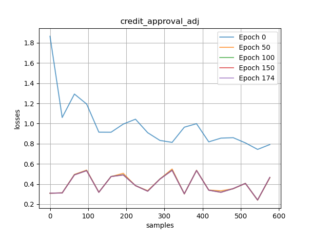
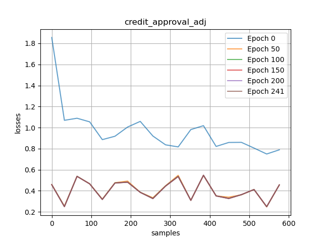
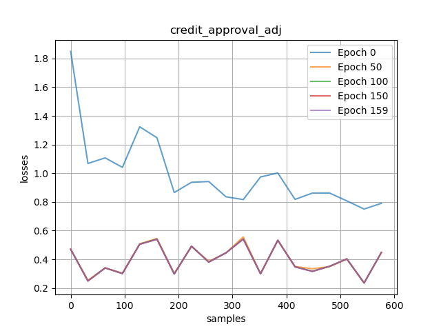
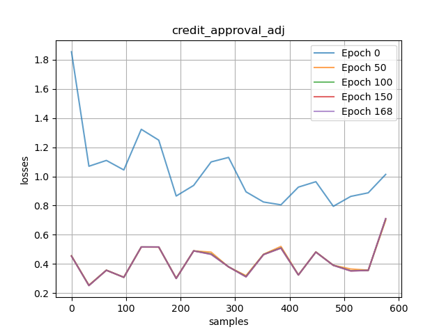

\newpage


# Credit Approval Dataset

#### This section is implemented by William Cai, including the code and the writeup. 

## I. Nature of the Dataset and Algorithms   

The Credit Approval Dataset is composed of 653 credit card applications. It has 6 numerical features and 9 categorical features. The goal is to predict whether a given credit card application should be approved or not.  

Because the dataset contains high-dimensional data, traditional data analysis like regressions are ill-suited for the tasks. We should explore multiple powerful machine learning algorithms to address this problem. Because most tools are not good at handling categorical features, we can use one-hot encoding to preprocess the categorical features. This would further expand the dimension of the dataset. 

The $k$-NN algorithm is good at finding the similarity between instances by calculating their Euclidean distances in the high-dimensional space. This method is effective, since we suspect that all features about the voice attributes are of similar importance. At least, when we do not know about the relative importance of features, treating them equally is a good baseline starting point. The drawback of $k$-NN is that the dataset being super high in dimension means many "useless" features that mislead $k$-NN to a dead end. But this is not our case: 6 + 9 features are moderate, even after one-hot encoding expansion, and they are all clearly related to credit approval or not approval by the dataset provider. 

The random forest algorithm could be suitable for this problem. It is built on many decision trees and uses bootstrapping and feature sampling to get robust results. If there are some features that are more important in classifying the disease, the decision tree will find such features based on the larger information gain via entropy or the Gini index. It compliments $k$-NN's treating features equally. This allows it to be resistant to some noise in the data. The drawback is that it could be hard to interpret than a simple decision tree, and it is often computationally expensive. We can alleviate this by multiprocessing to use all CPU cores.

We also explore neural networks for this dataset. With adequately sophisticated neural network configuration and non-linear activation functions like Sigmoid or ReLU at each neuron, and enough training data points, a NN can learn and potentially approximate any curves, and discover the hidden rules if there are any. This opens new ways for us to let the neural network learn from data by adjusting weights and biases in an automated fashion, without us to guess how to pick features. This powerful method comes with potential over curve-fitting, so we thus deploy regularization to mitigate such risks. Most complex NNs need intensive parallel computing, which may require RTX A6000, A100, H100, or H200. Fortunately, our dataset is small or moderate, and our CPU is quite cappable of doing it.


### Dataset Preprocessing   

Since this dataset has 9 categorical features, in addition to 6 numerical features, we need to use one-hot encoding on these categorical features.  

The unique values in those features are:

```
 {'attr1_cat': {'a', 'b'},
  'attr4_cat': {'l', 'u', 'y'},
  'attr5_cat': {'g', 'gg', 'p'},
  'attr6_cat': {'aa',
   'c',
   'cc',
   'd',
   'e',
   'ff',
   'i',
   'j',
   'k',
   'm',
   'q',
   'r',
   'w',
   'x'},
  'attr7_cat': {'bb', 'dd', 'ff', 'h', 'j', 'n', 'o', 'v', 'z'},
  'attr9_cat': {'f', 't'},
  'attr10_cat': {'f', 't'},
  'attr12_cat': {'f', 't'},
  'attr13_cat': {'g', 'p', 's'}})

```

For example, `attr13_cat` has three unique values: `{'g', 'p', 's'}`. The one-hot encodings for this feature are [1, 0, 0] for 'g', [0, 1, 0] for 'p', and [0, 0, 1] for 's'. We therefore replace column `attr13_cat` with three columns: `attr13_cat_g`, `attr13_cat_p`, and `attr13_cat_s`.  

We call this encoded file credit_approval_adj.csv. Now, the features in the dataset are all numerical, conducive to our data analysis algorithms below.  


## II. Algorithms

### 1. $k$-NN

The features are first scaled to [0, 1] using our own MinMaxScaler class before feeding the data to $k$-NN.  This is a straighrforward but important step to avoid meaningless or misleading scaling or unit distortions among features in calculating the distance between two instances, i.e., how similar and close they are.  

Our $k$-NN code supports many options as shown below.  

```
$ python knn_cv.py --help
usage: knn_cv.py [-h] [-p PATH] [-n ROUNDS] [-kmin KMIN] [-kmax KMAX]
                 [-exclude_self EXCLUDE_SELF] [-skip_norm SKIP_NORMALIZATION]
                 [-header HEADER] [-kfold NUM_KFOLDS] [-random_state RANDOM_STATE]

optional arguments:
  -h, --help            show this help message and exit
  -p PATH, --path PATH  CSV path od data file, default wdbc_wo_header.csv
  -n ROUNDS, --rounds ROUNDS
                        Rounds for KNN run, default 20
  -kmin KMIN, --kmin KMIN
                        Min K in KNN, default 1
  -kmax KMAX, --kmax KMAX
                        Max K for KNN, default 52
  -exclude_self EXCLUDE_SELF, --exclude_self EXCLUDE_SELF
                        Exclude self in traing, defualt False
  -skip_norm SKIP_NORMALIZATION, --skip_normalization SKIP_NORMALIZATION
                        Skip normalization, default False
  -header HEADER, --header HEADER
                        CSV file header or not, default None
  -kfold NUM_KFOLDS, --num_kfolds NUM_KFOLDS
                        number of folds for stratified K-Fold, default 5
  -random_state RANDOM_STATE, --random_state RANDOM_STATE
                        random seed like 42, -5, default None


The following command runs $k$-NN with our own stratified $k$-fold with shuffling.  


$ time python knn_cv.py --header true --exclude_self false \
                        --num_kfolds 10 -p credit_approval_adj.csv

Stratified Results:


Mean Train Metrics: 
    Accuracy  Precision    Recall        F1
1   1.000000   1.000000  1.000000  1.000000
3   0.912202   0.911839  0.910916  0.911331
5   0.896040   0.895191  0.895044  0.895107
7   0.891103   0.890180  0.890112  0.890135
9   0.886853   0.885822  0.885937  0.885871
11  0.886342   0.885441  0.885214  0.885304
13  0.882597   0.881749  0.881370  0.881508
15  0.881404   0.880668  0.879958  0.880257
17  0.878517   0.877540  0.877383  0.877427
19  0.873241   0.872151  0.872109  0.872120
21  0.868301   0.867091  0.867269  0.867174
23  0.868473   0.867140  0.867876  0.867451
25  0.871535   0.870216  0.870964  0.870540
27  0.871876   0.870564  0.871277  0.870878
29  0.871365   0.870025  0.870842  0.870382
31  0.876468   0.875220  0.875925  0.875504
33  0.874424   0.873182  0.873767  0.873424
35  0.875105   0.873969  0.874166  0.874042
37  0.874595   0.873533  0.873507  0.873492
39  0.872723   0.871688  0.871538  0.871582
41  0.873575   0.872528  0.872382  0.872437
43  0.871873   0.870855  0.870601  0.870702
45  0.871022   0.870008  0.869726  0.869842
47  0.871021   0.870039  0.869757  0.869845
49  0.870173   0.869143  0.868982  0.869011
51  0.871364   0.870297  0.870200  0.870218

Mean Test Metrics: 
    Accuracy  Precision    Recall        F1
1   0.819488   0.824862  0.816351  0.816155
3   0.857770   0.862433  0.855628  0.855216
5   0.867096   0.868678  0.866533  0.865591
7   0.871618   0.872966  0.871550  0.870431
9   0.868470   0.871992  0.867745  0.866837
11  0.873062   0.877274  0.871951  0.871372
13  0.871547   0.875667  0.870562  0.869821
15  0.868423   0.872482  0.867687  0.866561
17  0.857699   0.861628  0.856682  0.855569
19  0.859285   0.863745  0.856981  0.856832
21  0.860799   0.864012  0.859279  0.858857
23  0.862338   0.865450  0.861281  0.860605
25  0.860728   0.864342  0.859813  0.859001
27  0.856041   0.860347  0.854305  0.853799
29  0.859142   0.863121  0.857753  0.857224
31  0.868280   0.872170  0.866977  0.866384
33  0.871310   0.875383  0.869755  0.869383
35  0.868233   0.871711  0.866642  0.866369
37  0.865274   0.869420  0.863071  0.862982
39  0.860634   0.864413  0.858807  0.858445
41  0.863664   0.867254  0.862140  0.861568
43  0.859119   0.862477  0.857696  0.857051
45  0.856041   0.859118  0.854583  0.854023
47  0.856136   0.859350  0.854958  0.854257
49  0.856088   0.859276  0.854622  0.854159
51  0.854526   0.857605  0.853472  0.852701
```


   


As we can see in the above chart, the training set achieves accuracy 100% when $k=1$.  This is because the model is comparing a data point itself (the closest distance is zero) for classification, hence the `--exclude_self false` option. This distortion continues for small $k$ values. This self-included effect gradually fades away for large $k$.

Let me exclude the data point itself in the classification by setting `--exclude_self true`.


```
$ python knn_cv.py --header true --exclude_self true --num_kfolds 10 -p credit_approval_adj.csv

Stratified Results:


Mean Train Metrics: 
    Accuracy  Precision    Recall        F1
1   0.813338   0.812113  0.810749  0.811312
3   0.854688   0.853702  0.852928  0.853262
5   0.863875   0.862587  0.863030  0.862767
7   0.869662   0.868591  0.868548  0.868516
9   0.866428   0.865320  0.865268  0.865251
11  0.864556   0.863498  0.863267  0.863329
13  0.866429   0.865313  0.865270  0.865254
15  0.864214   0.863138  0.862988  0.863006
17  0.860135   0.858920  0.859097  0.858951
19  0.857581   0.856233  0.856728  0.856435
21  0.858603   0.857239  0.857791  0.857475
23  0.860133   0.858840  0.859191  0.858977
25  0.863196   0.861898  0.862343  0.862083
27  0.863027   0.861745  0.862159  0.861908
29  0.863536   0.862292  0.862591  0.862398
31  0.866773   0.865540  0.865873  0.865671
33  0.866941   0.865859  0.865738  0.865755
35  0.865919   0.864867  0.864642  0.864707
37  0.866602   0.865563  0.865331  0.865398
39  0.865579   0.864518  0.864300  0.864366
41  0.862688   0.861616  0.861399  0.861455
43  0.863538   0.862558  0.862080  0.862264
45  0.861669   0.860689  0.860146  0.860366
47  0.861495   0.860396  0.860179  0.860244
49  0.863366   0.862263  0.862179  0.862159
51  0.864555   0.863498  0.863235  0.863323

Mean Test Metrics: 
    Accuracy  Precision    Recall        F1
1   0.813260   0.815834  0.808964  0.810260
3   0.862265   0.864002  0.860729  0.860907
5   0.866787   0.867982  0.866320  0.865640
** 7   0.871474   0.873149  0.870328  0.870131
9   0.869937   0.871333  0.869495  0.868801
11  0.865344   0.866925  0.865289  0.864250
13  0.863805   0.865266  0.863049  0.862544
15  0.860703   0.861553  0.859636  0.859405
17  0.862265   0.862438  0.861342  0.861099
19  0.863781   0.864069  0.863027  0.862644
21  0.860703   0.861345  0.859636  0.859454
23  0.859188   0.859809  0.858265  0.857887
25  0.853080   0.853640  0.852670  0.851925
27  0.863733   0.864932  0.863820  0.862728
29  0.865248   0.867416  0.865209  0.864131
31  0.865296   0.868116  0.864971  0.864019
33  0.868279   0.870985  0.867692  0.866916
35  0.863686   0.866188  0.863190  0.862329
37  0.871309   0.872981  0.871025  0.870122
39  0.874387   0.876868  0.873269  0.873002
41  0.872824   0.875145  0.871840  0.871453
43  0.872824   0.874460  0.872414  0.871711
45  0.871309   0.873698  0.871025  0.870110
47  0.874481   0.876941  0.873940  0.873251
49  0.874481   0.876948  0.874217  0.873274
51  0.872966   0.875330  0.872828  0.871788

(** indicates the optimal tuning parameters)

```


   


We found the Testing set resemble the training set in accuracy, precision, recall, and F1. This further boost the confidence of reliable results.  

As we can see, $k$-NN improves performs from k=1 tp 7, as the model seek closeness from kneighboring data points. All accuracy, precision, recall, and F1 peaks at k=7, indicating maximum signal when k=7. As more data points included, the signal is diluted, and performance decline, until k=20. Performances slowly climbs afterwards for both training and testing sets. It never reach previous peaks on training set. 

How to pick the best $k$ values? I would like to pick k= 5, 7, and 9. From charts, all accuracy, precision, recall, and F1 are about 0.87, for training set. Such results are confimed in testing set. For credit approval application, false positive means big financial loss from persons who can not pay back. So high precision is very beneficial. The highest F1 near 0.87 shows robustness of these result. 

Ideally, I would peak the optimal $k=7$, exactly at the performance peak, with surrounding performance at $k=5$ and 9 also stable and good.


\newpage

## 2. Random Forest

```
$ python random_forest.py --help

usage: random_forest.py [-h] [-p PATH] [-ntrees NUM_TREES] [-dmin MIN_DEPTH]
                        [-dmax MAX_DEPTH] [-smin MIN_SAMPLES] [-igmin MIN_INFO_GAIN]
                        [-skip_norm SKIP_NORMALIZATION] [-bst ISBST] [-gini USE_GINI]
                        [-early_stop EARLY_STOP_THRESHOLD] [--random_state RANDOM_STATE]

optional arguments:
  -h, --help            show this help message and exit
  -p PATH, --path PATH  csv file path, like wdbc.csv
  -ntrees NUM_TREES, --num_trees NUM_TREES
                        number of trees if it is greater than zero, 0 to loop over [1 5 10 20
                        30 40 50], less than 0 to loop over [1 5 10 20 30 40 50 75 100 125
                        150 200 250 300], default 0
  -dmin MIN_DEPTH, --min_depth MIN_DEPTH
                        Min depth of tree, default 2
  -dmax MAX_DEPTH, --max_depth MAX_DEPTH
                        Max depth of tree, default 8
  -smin MIN_SAMPLES, --min_samples MIN_SAMPLES
                        Min samples for split, default 2
  -igmin MIN_INFO_GAIN, --min_info_gain MIN_INFO_GAIN
                        Minimum information gain, default 0.001
  -skip_norm SKIP_NORMALIZATION, --skip_normalization SKIP_NORMALIZATION
                        skip simulation, default True
  -bst ISBST, --isBST ISBST
                        Use numerical splitting, default False
  -gini USE_GINI, --use_gini USE_GINI
                        Use Gini coefficient, default False
  -early_stop EARLY_STOP_THRESHOLD, --early_stop_threshold EARLY_STOP_THRESHOLD
                        Early majority stop threshold like 0.85, default 1.00
  --random_state RANDOM_STATE
                        random seed like 42, -5, default None

```

Use use -ntrees -1 to let the random forest algorithms to loop over [1 5 10 20 30 40 50 75 100 125 150 200 250 300] trees.  

To handle the large computational demand, multiprocessing are used to use multicores (overcome python GIL lock). multiprocessing queues are used to feed workers with tasks, and collect results.  For details,  please see code.  


```
$ python random_forest.py -bst true --random_state 42 -p credit_approval_adj.csv

Random Forest Performance: 
    Accuracy  Precision    Recall        F1
1   0.701682   0.704034  0.697459  0.696212
5   0.774921   0.780442  0.768733  0.769602
10  0.799349   0.812550  0.790203  0.792452
20  0.817718   0.825202  0.810173  0.812904
30  0.839116   0.844212  0.832614  0.835392
40  0.839116   0.849252  0.830607  0.834262
50  0.836086   0.847841  0.826931  0.830663
```

All our algorithms are properly handling random state, making results repeatable.


```
$ python random_forest.py -bst true -ntrees -1 --random_state 42 \
                        -p credit_approval_adj.csv


Random Forest Performance: 
     Accuracy  Precision    Recall        F1
1    0.701682   0.704034  0.697459  0.696212
5    0.774921   0.780442  0.768733  0.769602
10   0.799349   0.812550  0.790203  0.792452
20   0.817718   0.825202  0.810173  0.812904
30   0.839116   0.844212  0.832614  0.835392
40   0.839116   0.849252  0.830607  0.834262
50   0.836086   0.847841  0.826931  0.830663
75   0.848300   0.856746  0.840959  0.844188
100  0.854431   0.863912  0.846859  0.850430
125  0.857484   0.865068  0.850527  0.853893
150  0.849827   0.859689  0.841794  0.845493
200  0.855934   0.866037  0.847973  0.851810
250  0.857484   0.866872  0.849954  0.853587
300  0.852869   0.863082  0.844869  0.848623
```

   


We also explored the Gini index to see whether it offers an improvement over entropy in picking the best features and values to split.

```
$ python random_forest.py -bst true -ntrees -1 -gini true \
                            --random_state 42 -p credit_approval_adj.csv

Random Forest Performance: 
     Accuracy  Precision    Recall        F1
1    0.701705   0.704163  0.697487  0.696098
5    0.779490   0.784502  0.772624  0.774221
10   0.800970   0.817330  0.790218  0.792797
20   0.820830   0.832013  0.812121  0.815204
30   0.840701   0.848978  0.832905  0.836265
40   0.845305   0.857116  0.836575  0.840332
50   0.837659   0.849999  0.828665  0.832200
75   0.848289   0.858594  0.840377  0.843701
100  0.846762   0.857467  0.838404  0.842091
** 125  0.857461   0.865968  0.850212  0.853666
150  0.849827   0.859689  0.841794  0.845493
200  0.852904   0.864611  0.844324  0.848299
250  0.852916   0.863803  0.844639  0.848562
300  0.857461   0.867535  0.849639  0.853345

(** indicates the optimal tuning parameters)
```

   


Both entropy and the Gini index offer very similar performances. They all start with low accuracy, precision, recall, and F1  for low `ntrees` counts. This is expected, as a random forest relies on collecting the wisdom of weak learners. Each decision tree offers better than random performance, but it is far from stellar. As `ntrees` reaches 40, performance is significantly improved, with accuracy 0.841 and F1 0.840. The model continues to improve, synergizing the knowledges of more decision trees, until ntrees around 125. This is the point all metrics peak together, with accuracy 0.857, precision 0.865, recall 0.850, and F1 0.854. Then the performance more or less is flat. This is the point of diminishing return for more computing. 

The chart by the Gini index is similar with small variations. This confirmation is welcome in our analysis.

Since the performance is stable and very flat from `ntrees` 100 to 300, we would pick the peak performance near the low end `ntrees = 125` as the optimal hyperparameter for the random forest algorithm for highest performance. 


## 3. NN

We should caution against overfitting with deep and dense neural network. We only have 584 data samples. Considering there are 46 features in the data after one-hot encoding, if the first layer has 16 neurons, it takes $46 x 16 = 736$ parameters, which is more than our data points. 

```
$ python nn.py --help
usage: nn.py [-h] [-p PATH] [-input NUM_INPUT] [-output NUM_OUTPUT]
             [-neuron HIDDEN_NEURONS] [-activation ACTIVATION] [-batch BATCH_SIZE]
             [-lr LEARNING_RATE] [-rlambda RLAMBDA]
             [-loss_delta LOSS_DELTA_THRESHOLD] [-k K_EPOCH_SHUFFLE]
             [-epoch EPOCHS] [-kfold NUM_KFOLDS] [-random_state RANDOM_STATE]
             [-proj PROJECT_NAME_PREFIX]

optional arguments:
  -h, --help            show this help message and exit
  -p PATH, --path PATH  csv file path, like wdbc.csv
  -input NUM_INPUT, --num_input NUM_INPUT
                        number of input, default 5
  -output NUM_OUTPUT, --num_output NUM_OUTPUT
                        number of output, default 1
  -neuron HIDDEN_NEURONS, --hidden_neurons HIDDEN_NEURONS
                        Hidden layer neurons, default [10]
  -activation ACTIVATION, --activation ACTIVATION
                        Non-output activation function, default sigmoid
  -batch BATCH_SIZE, --batch_size BATCH_SIZE
                        batch size, default 16
  -lr LEARNING_RATE, --learning_rate LEARNING_RATE
                        Learning rate, default 0.01
  -rlambda RLAMBDA, --rlambda RLAMBDA
                        Regularization lambda, default 0.01
  -loss_delta LOSS_DELTA_THRESHOLD, --loss_delta_threshold LOSS_DELTA_THRESHOLD
                        Early stop loss limit, default 0.001
  -k K_EPOCH_SHUFFLE, --k_epoch_shuffle K_EPOCH_SHUFFLE
                        Shuffle training data per k epochs, default -1 (never)
  -epoch EPOCHS, --epochs EPOCHS
                        number of epochs, default 1000
  -kfold NUM_KFOLDS, --num_kfolds NUM_KFOLDS
                        number of folds for stratified K-Fold, default 5
  -random_state RANDOM_STATE, --random_state RANDOM_STATE
                        random seed like 42, -5, default None
  -proj PROJECT_NAME_PREFIX, --project_name_prefix PROJECT_NAME_PREFIX
                        Project name prefix, like myproject, default proj
```

We want to build a simple network with strong performance, rather than a complex network of over curve-fitting. So we start explore network with single hidden layer with low neuron count, then two hidden layers, then three hidden layers. We shall see that a moderate network is adequate. 

The tuning of learning rate and regularization rate are key to performing model.  


```
$ python nn.py --hidden_neurons "16 16" -lr 0.01 -rlambda 0.01 \
                    --batch_size 16 --loss_delta_threshold 0.001 \
                    --k_epoch_shuffle -1 -kfold 5 --random_state 42 \
                    -p credit_approval_adj.csv

```


| NN | batch size | lr | rlambda | loss | Accuracy | Precision | Recall | F1 |
| :---: | :-: | :-: | :-: | :-: | :-: | :-: | :-: | :-: |
| 46, [2], 1 | 16 | 0.01| 0.01 | 0.35041 | 0.86066 | 0.86090 | 0.86199 | 0.85989 |
| 46, [4], 1 | 64 | 0.04| 0.04 | 0.36057 | 0.85597 | 0.85635 | 0.85680 | 0.85511 |
| 46, [8], 1 | 16 | 0.01| 0.01 | 0.36485 | 0.86989 | 0.87063 | 0.87044 | 0.86901 |
| 46, [8], 1 | 64 | 0.05| 0.1 | 0.34365 | 0.86537 | 0.86711 | 0.86857 | 0.86491 |
| 46, [16], 1 | 64 | 0.01| 0.05 | 0.35033 | 0.86677 | 0.86722 | 0.86844 | 0.86611 |
| 46, [64], 1 | 64 | 0.05| 0.05 | 0.36635 | 0.86544 | 0.86644 | 0.86581 | 0.86441 |
| 46, [2, 2], 1 | 64 | 0.04| 0.04 | 0.34602 | 0.86539 | 0.86536 | 0.86625 | 0.86461 |
| 46, [4, 2], 1 | 64 | 0.04| 0.04 | 0.37200 | 0.86229 | 0.86224 | 0.86223 | 0.86119 |
| 46, [4, 4], 1 | 64 | 0.04| 0.04 | 0.36472 | 0.86253 | 0.86353 | 0.86199 | 0.86138 |
| 46, [4, 8], 1 | 32 | 0.05| 0.1 | 0.34901 | 0.88234 | 0.88544 | 0.88674 | 0.88218 |
| 46, [4, 8], 1 | 64 | 0.05| 0.1 | 0.34754 | 0.86385 | 0.86599 | 0.86490 | 0.86285 |
| 46, [8, 8], 1 | 64 | 0.05| 0.05 | 0.35577 | 0.86703 | 0.86706 | 0.86748 | 0.86608 |
| 46, [8, 8], 1 | 16 | 0.01| 0.01 | 0.38466 | 0.85460 | 0.85632 | 0.85381 | 0.85327 |
| 46, [16, 8], 1 | 16 | 0.04| 0.04 | 0.35071 | 0.87467 | 0.87804 | 0.87884 | 0.87446 |
| 46, [16, 8], 1 | 16 | 0.06| 0.04 | 0.35512 | 0.87145 | 0.87665 | 0.87558 | 0.87109 |
| 46, [16, 8], 1 | 32 | 0.06| 0.04 | 0.35298 | 0.86994 | 0.87336 | 0.87335 | 0.86959 |
| 46, [16, 8], 1 | 64 | 0.06| 0.02 | 0.44303 | 0.84996 | 0.85180 | 0.84806 | 0.84801 |
| 46, [16, 16], 1 | 64 | 0.04| 0.04 | 0.37055 | 0.86075 | 0.86086 | 0.86114 | 0.85976 |
| 46, [32, 32], 1 | 64 | 0.04| 0.04 | 0.38846 | 0.85931 | 0.86097 | 0.85849 | 0.85788 |
| 46, [16, 16], 1 | 64 | 0.03| 0.02 | 0.51221 | 0.84536 | 0.84673 | 0.84395 | 0.84350 |
| 46, [16, 16], 1 | 64 | 0.06| 0.02 | 0.44872 | 0.84844 | 0.84795 | 0.84850 | 0.84742 |
| 46, [32, 32], 1 | 64 | 0.04| 0.04 | 0.38846 | 0.85931 | 0.86097 | 0.85849 | 0.85788 |
| 46, [4, 4, 4], 1 | 64 | 0.04| 0.04 | 0.37343 | 0.86082 | 0.86222 | 0.86168 | 0.85972 |
| 46, [2, 2, 2], 1 | 64 | 0.04| 0.04 | 0.35490 | 0.85775 | 0.85883 | 0.85729 | 0.85638 |
(* indicates the best network configuration.)


For single layer, as we can see the perfornace metrics are similar for nurons 2, 4, 8, 16 and 32. They all have low loss around 0.35 , accuracy 0.86, precision 0.86, recall 0.86, and F1 0.86.  This hint simple network with low neurons. It might suggest more than 8 neurons are unnecessary complexity, yet less that 2 is unnecessay limiting.

From the above table, we can see that network with two hdden layers are in general not much better performing than the single hidden layer. Some more complexed models performs a lot worse. 

Three hidden layers does not help performance. It seems brittle: with small channges and the performances tanks.  This is like due to overfitting. 

We ar mostly interesting in simple network with two hidden layers, for these reasons: it is as performing as single layer but offer a lot more options to tune. In particular, we pick hidden layer [8, 2] network to further tune for crank up performance.  

#### Tune hyperparameters

Since the dataset is credit approval, F1 and accuracy is of ultimate importance, because it could mean that the business could avoid unnecessary loss for bad approvals, or missed profit for deny qualified applicants. For the same or close accuracy and F1 values, we would like the ones with lower loss because the higher confidence it implied.  

| NN | batch size | lr | rlambda | loss | Accuracy | Precision | Recall | F1 |
| :---: | :-: | :-: | :-: | :-: | :-: | :-: | :-: | :-: |
| 46, [4, 8], 1 | 32 | 0.05| 0.1 | 0.34780 | 0.88083 | 0.88410 | 0.88535 | 0.88068 |
| 46, [4, 8], 1 | 32 | 0.05| 0.05 | 0.34602 | 0.88083 | 0.88367 | 0.88479 | 0.88059 |
| 46, [4, 8], 1 | 32 | 0.025| 0.05 | 0.34648 | 0.86996 | 0.87093 | 0.87282 | 0.86955 |
| 46, [4, 8], 1 | 32 | 0.04| 0.05 | 0.34622 | 0.87467 | 0.87684 | 0.87831 | 0.87436 |
| 46, [4, 8], 1 | 32 | 0.05| 0.025 | 0.38195 | 0.85453 | 0.85756 | 0.85606 | 0.85352 |
| 46, [4, 8], 1 | 32 | 0.06| 0.04 | 0.35022 | 0.87609 | 0.87824 | 0.87928 | 0.87577 |
| 46, [4, 8], 1 | 32 | 0.06| 0.12 | 0.35361 | 0.87614 | 0.88020 | 0.88104 | 0.87601 |
| ** 46, [4, 8], 1 | 32 | 0.04| 0.075 | 0.34435 | 0.88083 | 0.88347 | 0.88479 | 0.88060 |
| 46, [4, 8], 1 | 32 | 0.035| 0.08 | 0.34396 | 0.87770 | 0.88006 | 0.88193 | 0.87746 |
| 46, [4, 8], 1 | 32 | 0.045| 0.09 | 0.34624 | 0.88083 | 0.88382 | 0.88507 | 0.88063 |
| 46, [4, 8], 1 | 32 | 0.04| 0.09 | 0.34531 | 0.88083 | 0.88347 | 0.88479 | 0.88060 |
| 46, [4, 8], 1 | 32 | 0.04| 0.07 | 0.34423 | 0.87927 | 0.88157 | 0.88307 | 0.87903 |
(** indicates the optimal tuning parameters)


```
$ python nn.py --hidden_neurons "4 8" -lr 0.04 -rlambda 0.075 \
                --batch_size 32 --loss_delta_threshold 0.0001 \
                --k_epoch_shuffle -1 -kfold 10 --random_state 42 -p parkinsons.csv
```

Stratified K-Fold losses: 
[0.3301494868319709, 0.24885913737392373, 0.4531295853945854, 0.29652771447233056, 0.3964249416918928, 0.3948749714403346, 0.4001884155392198, 0.3481832062231985, 0.3389782557122496, 0.23617020256378046] 
mean loss: 0.3443485917243486

Stratified K-Fold Performances: 
   Accuracy  Precision    Recall        F1
0  0.878788   0.880515  0.883333  0.878676
1  0.939394   0.938419  0.941667  0.939171
2  0.818182   0.817096  0.819444  0.817512
3  0.893939   0.893939  0.897222  0.893720
4  0.833333   0.837327  0.838889  0.833295
5  0.848485   0.847426  0.850000  0.847926
6  0.846154   0.860521  0.857759  0.846117
7  0.890625   0.890625  0.894089  0.890384
8  0.875000   0.882759  0.882759  0.875000
9  0.984375   0.986111  0.982759  0.984186

Stratified K-Fold Mean Performances: 
Accuracy     0.880828
Precision    0.883474
Recall       0.884792
F1           0.880599












### 4. Summary 

All KNN, random forest, and NN delived solid results:    

```
KNN:  accuracy 0.8715 F1 0.8701
RD:   accuracy 0.8575 F1 0.8537
NN:   accuracy 0.8808 F1 0.8806
```

All accuracy > 0.85, all F1 > 0.85. The consistency boost our confidence in the results.  

RF show remarkable resistance to noise, with stable and consistent high performance for $ntrees \ge 125$.  

NN is the top performer here. We know NN shines on large data set. But we only have 653 data samples here. This shows the power of NN and proper hyperparameter tunning.

KNN performers well here too. This might due to the clean data set in credit approval dataset, despite those data tends to be noisy. All features are more or less equally important. And, it has moderate demension. This is where KNN shines.

