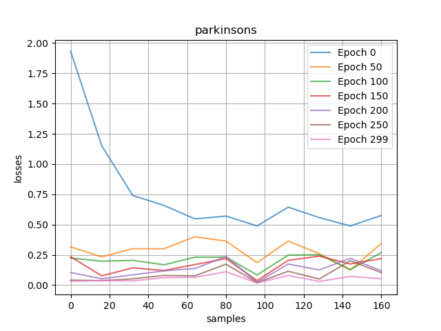
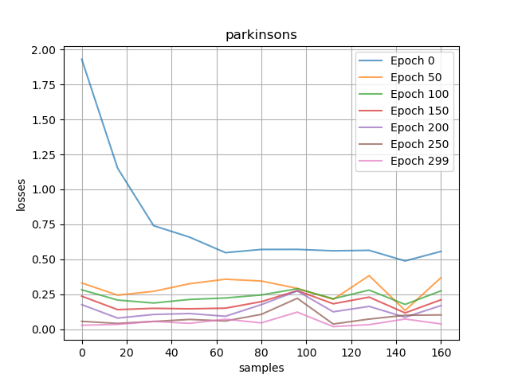

\newpage

# Parkinsons Dataset

#### This section is implemented by William Cai, including the code and the writeup. 


## I. Nature of the Dataset and Algorithms   

The Oxford Parkinson's Diseases Detection Dataset is composed of a range of biomedical voice measurements of people with or without Parkinson's disease. It has 22 numerical features. The goal is to detect whether a person is healthy or with Parkinson's disease.  


Because the dataset contains high-dimensional data, traditional data analysis like regressions are ill-suited for the tasks. We should explore multiple powerful machine learning algorithms to address this problem.  

The $k$-NN algorithm is good at finding the similarity between instances by calculating their Euclidean distances in a high-dimensional space. This method is effective, since we suspect that all features about the voice atrributes are of similar importance. At least, when we do not know about the relative importance of features, treating them equally is a good baseline starting point. The drawback of $k$-NN is that the dataset being super high in dimension means that there are many "useless" features that mislead $k$-NN to a dead end. But this is not our case: 22 features are moderate, and they are all clearly relating to Parkinson's (or the absence thereof), by researchers. 

The random forest algorithm could be suitable for this problem. It is built on many decision trees and uses bootstrapping and feature sampling to get robust results. If there are some features that are more important in classifying the disease, the decison tree will find out such features by obtaining the larger information gain via entropy or the Gini index. It compliments $k$-NN's treating features equally. This allows it to be resistant to some noise in the data. The drawback is that it could be hard to interpret than a simple decision tree, and it is often computationally expensive. We can alleviate this by multiprocessing to use all CPU cores.

We also explore neural networks for this dataset. With adequately sophisticated neural network configuration and non-linear activation functions like Sigmoid or ReLU at each neuron, and enough training data points, a NN can learn and potentially approximate any curves, and discover the hidden rules if there are any. This opens new ways for us to let the neural network learn from data by adjusting weights and biases in an automated fashion, without us to guess how to pick features. This powerful method comes with potential over curve-fitting, so we thus deploy regularization to mitigate such risks. Most complex NNs need intensive parallel computing, which may require RTX A6000, A100, H100, or H200. Fortunately, our dataset is small or moderate, and our CPU is quite cappable of doing it.  

\

## II. Algorithms


### 1. $k$-NN

The features are first scaled to [0, 1] using our own MinMaxScaler class before feeding them to the $k$-NN.  This is a straightforward but important step to avoid meaningless or misleading scaling or unit distortions among features in calculating the distance between two instances, i.e., how similar and close they are.  

Our $k$-NN code support many options as shown below.  

```
$ python knn_cv.py --help
usage: knn_cv.py [-h] [-p PATH] [-n ROUNDS] [-kmin KMIN] [-kmax KMAX]
                 [-exclude_self EXCLUDE_SELF] [-skip_norm SKIP_NORMALIZATION]
                 [-header HEADER] [-kfold NUM_KFOLDS] [-random_state RANDOM_STATE]

optional arguments:
  -h, --help            show this help message and exit
  -p PATH, --path PATH  CSV path od data file, default wdbc_wo_header.csv
  -n ROUNDS, --rounds ROUNDS
                        Rounds for KNN run, default 20
  -kmin KMIN, --kmin KMIN
                        Min K in KNN, default 1
  -kmax KMAX, --kmax KMAX
                        Max K for KNN, default 52
  -exclude_self EXCLUDE_SELF, --exclude_self EXCLUDE_SELF
                        Exclude self in traing, defualt False
  -skip_norm SKIP_NORMALIZATION, --skip_normalization SKIP_NORMALIZATION
                        Skip normalization, default False
  -header HEADER, --header HEADER
                        CSV file header or not, default None
  -kfold NUM_KFOLDS, --num_kfolds NUM_KFOLDS
                        number of folds for stratified K-Fold, default 5
  -random_state RANDOM_STATE, --random_state RANDOM_STATE
                        random seed like 42, -5, default None


The following command runs $k$-NN with our own stratified $k$-fold with shuffling.  

$ python knn_cv.py --header true --exclude_self false --num_kfolds 10 -p parkinsons.csv

Stratified Results:


Mean Train Metrics: 
    Accuracy  Precision    Recall        F1
1   1.000000   1.000000  1.000000  1.000000
3   0.978925   0.964033  0.981339  0.972133
5   0.958986   0.944525  0.945483  0.944647
7   0.947025   0.942123  0.913403  0.926396
9   0.941321   0.942955  0.897139  0.916935
11  0.922512   0.922249  0.864443  0.888386
13  0.907148   0.913029  0.830931  0.861749
15  0.886050   0.898369  0.787209  0.823180
17  0.858118   0.886512  0.725786  0.764043
19  0.842741   0.890008  0.688295  0.724802
21  0.836469   0.890918  0.673992  0.708410
23  0.832472   0.897354  0.662788  0.694616
25  0.831342   0.900377  0.659757  0.690288
27  0.833621   0.909732  0.662077  0.693267
29  0.833618   0.906606  0.662838  0.693937
31  0.835326   0.910511  0.665539  0.697385
33  0.834767   0.910267  0.664429  0.695919
35  0.840456   0.912796  0.675951  0.710637
37  0.839881   0.912527  0.674762  0.709311
39  0.825076   0.901811  0.646309  0.663870
41  0.822238   0.902895  0.639790  0.654743
43  0.821108   0.904649  0.636734  0.651953
45  0.817140   0.900572  0.629537  0.643290
47  0.814270   0.899253  0.623643  0.636318
49  0.801747   0.893592  0.598194  0.599940
51  0.794906   0.890550  0.584294  0.579130

Mean Test Metrics: 
    Accuracy  Precision    Recall        F1
1   0.947807   0.933036  0.952143  0.935038
3   0.927251   0.915000  0.903214  0.902480
5   0.911988   0.896712  0.879881  0.878833
7   0.916959   0.907635  0.874286  0.883803
9   0.896988   0.884510  0.849881  0.857592
11  0.880585   0.879688  0.807976  0.825155
13  0.860058   0.873578  0.759048  0.778530
15  0.829240   0.829874  0.702976  0.723322
17  0.813129   0.808335  0.663810  0.684416
19  0.824503   0.876722  0.657857  0.680398
21  0.819503   0.781419  0.638929  0.645394
23  0.819503   0.781072  0.636667  0.642997
25  0.813947   0.780418  0.633095  0.641183
27  0.819503   0.781072  0.636667  0.642997
29  0.819503   0.781072  0.636667  0.642997
31  0.824503   0.806656  0.640000  0.647072
33  0.835058   0.861395  0.662500  0.678832
35  0.840614   0.863968  0.675000  0.693671
37  0.835614   0.861517  0.665000  0.683322
39  0.825614   0.856873  0.645000  0.659731
41  0.815058   0.851849  0.622500  0.634543
43  0.815614   0.852421  0.625000  0.635135
45  0.795614   0.743896  0.585000  0.573803
47  0.796170   0.744210  0.587500  0.577287
49  0.780906   0.588216  0.557500  0.523440
51  0.780906   0.588216  0.557500  0.523440
```

   

   


As we can see in the above chart, the training set achieves accuracy 100% when $k=1$.  This is because the model is comparing a data point itself (the closest distance is zero) for classification, hence the `--exclude_self false` option. This distortion continues for small $k$ values. This self-included effect gradually fades away for large $k$.  

Let me exclude the data point itself in the classification by setting `--exclude_self true`.  


```
$ python knn_cv.py --header true --exclude_self true --num_kfolds 10 -p parkinsons.csv

Stratified Results:


Mean Train Metrics: 
    Accuracy  Precision    Recall        F1
1   0.954421   0.930580  0.951038  0.940060
3   0.933330   0.909115  0.912898  0.910676
5   0.923077   0.898944  0.892860  0.895655
7   0.918522   0.905150  0.870353  0.885373
9   0.901989   0.889059  0.838336  0.859139
11  0.880343   0.867794  0.796666  0.822646
13  0.861534   0.861212  0.747568  0.781513
15  0.838771   0.838938  0.699802  0.732706
17  0.829621   0.845800  0.673396  0.705025
19  0.823920   0.844723  0.660274  0.689796
21  0.823365   0.866482  0.651374  0.679489
23  0.823365   0.882016  0.646667  0.674076
25  0.824501   0.896163  0.645854  0.673138
27  0.826793   0.897953  0.650531  0.678705
29  0.829079   0.901527  0.654399  0.684094
31  0.829063   0.903987  0.653535  0.683088
33  0.830202   0.905246  0.655858  0.685654
35  0.833053   0.909434  0.660888  0.692374
37  0.831891   0.906024  0.659267  0.689606
39  0.822751   0.902289  0.640662  0.659229
41  0.808553   0.896764  0.611883  0.620037
43  0.805121   0.894006  0.604907  0.608932
45  0.803423   0.896831  0.600740  0.605018
47  0.793173   0.885580  0.580673  0.574719
49  0.788604   0.890632  0.570587  0.559031
51  0.782926   0.884918  0.559875  0.541670

Mean Test Metrics: 
    Accuracy  Precision    Recall        F1
1   0.969181   0.961131  0.966190  0.959954
** 3   0.937251   0.919702  0.920714  0.916103
5   0.943626   0.942589  0.911429  0.920953
7   0.917807   0.905189  0.881190  0.885579
9   0.907544   0.892630  0.861190  0.870721
11  0.892515   0.883787  0.815595  0.838304
13  0.866696   0.870858  0.763095  0.784677
15  0.856140   0.854596  0.742857  0.769041
17  0.841170   0.888424  0.690833  0.717167
19  0.830058   0.796377  0.668095  0.681895
21  0.830614   0.848583  0.661667  0.679328
23  0.825058   0.806970  0.642500  0.650556
25  0.830058   0.835899  0.661429  0.680047
27  0.829503   0.785805  0.658929  0.671878
29  0.835058   0.811356  0.662500  0.677039
31  0.835058   0.811356  0.662500  0.677039
33  0.840614   0.813930  0.675000  0.691878
35  0.840877   0.814024  0.675000  0.691952
37  0.835877   0.811831  0.665000  0.678710
39  0.845877   0.816475  0.685000  0.702301
41  0.835877   0.811831  0.665000  0.678710
43  0.815322   0.702859  0.622500  0.617668
45  0.805322   0.748254  0.602500  0.595871
47  0.795322   0.693830  0.582500  0.567594
49  0.790322   0.641856  0.572500  0.549667
51  0.790322   0.641856  0.572500  0.549667

(** indicates the optimal tuning parameters)
```

   

   


We found the testing set resembles the training set in accuracy, precision, recall, and F1. This further boosts the confidence of reliable results.  

As we can see, $k$-NN performs best for $k<10$, then the performance sharply drops for $k=10~20$, then stablizes for $k=20~40$, then drops again. It could be that Parkinson's disease marks or absent marks are very notbale, so keeping a small $k$ is like keeping signal strong, whereas including far away data points dilutes the signal, thus weakening performance.

How to pick the best $k$ values? I would like to pick $k=$ 1, 3, or 5. From the charts, all accuracy, precision, recall, and F1 are above 0.90 for the training set. Such results are confirmed in testing set. For medical detection, false negatives are extremely harmful, so recall > 0.92 is very beneficial. F1 > 0.91 shows the robustness of these results. 

Due to risk of conincidence, we would favor $k=3$, or 5 over $k = 1$.  


\newpage

### 2. Random Forest

```
$ python random_forest.py --help

usage: random_forest.py [-h] [-p PATH] [-ntrees NUM_TREES] [-dmin MIN_DEPTH]
                        [-dmax MAX_DEPTH] [-smin MIN_SAMPLES] [-igmin MIN_INFO_GAIN]
                        [-skip_norm SKIP_NORMALIZATION] [-bst ISBST] [-gini USE_GINI]
                        [-early_stop EARLY_STOP_THRESHOLD] [--random_state RANDOM_STATE]

optional arguments:
  -h, --help            show this help message and exit
  -p PATH, --path PATH  csv file path, like wdbc.csv
  -ntrees NUM_TREES, --num_trees NUM_TREES
                        number of trees if it is greater than zero, 0 to loop over [1 5 10 20
                        30 40 50], less than 0 to loop over [1 5 10 20 30 40 50 75 100 125
                        150 200 250 300], default 0
  -dmin MIN_DEPTH, --min_depth MIN_DEPTH
                        Min depth of tree, default 2
  -dmax MAX_DEPTH, --max_depth MAX_DEPTH
                        Max depth of tree, default 8
  -smin MIN_SAMPLES, --min_samples MIN_SAMPLES
                        Min samples for split, default 2
  -igmin MIN_INFO_GAIN, --min_info_gain MIN_INFO_GAIN
                        Minimum information gain, default 0.001
  -skip_norm SKIP_NORMALIZATION, --skip_normalization SKIP_NORMALIZATION
                        skip simulation, default True
  -bst ISBST, --isBST ISBST
                        Use numerical splitting, default False
  -gini USE_GINI, --use_gini USE_GINI
                        Use Gini coefficient, default False
  -early_stop EARLY_STOP_THRESHOLD, --early_stop_threshold EARLY_STOP_THRESHOLD
                        Early majority stop threshold like 0.85, default 1.00
  --random_state RANDOM_STATE
                        random seed like 42, -5, default None


Use `-ntrees -1` to let the random forest algorithm loop over [1 5 10 20 30 40 50 75 100 125 150 200 250 300] trees.  

To handle the large computational demand, multiprocessing is used to use multicores (overcome python GIL lock). Multiprocessing queues are used to feed workers with tasks and collect results. For details, please see the code.  

$ python random_forest.py -bst true --random_state 42 -p parkinsons.csv

Random Forest Performance: 
    Accuracy  Precision    Recall        F1
1   0.810688   0.752122  0.756743  0.743992
5   0.861215   0.827278  0.789080  0.803977
10  0.876606   0.853321  0.820192  0.829893
20  0.902517   0.909036  0.837203  0.857684
30  0.897389   0.902747  0.820651  0.848971
40  0.902517   0.908428  0.830651  0.857514
50  0.913171   0.924270  0.846322  0.871725

All our algorithms are properly handling random state, making results repeatable.  

$ python random_forest.py -bst true -ntrees -1 --random_state 42 -p parkinsons.csv 

Random Forest Performance:
     Accuracy  Precision    Recall        F1
1    0.810688   0.752122  0.756743  0.743992
5    0.861215   0.827278  0.789080  0.803977
10   0.876606   0.853321  0.820192  0.829893
20   0.902517   0.909036  0.837203  0.857684
30   0.897389   0.902747  0.820651  0.848971
40   0.902517   0.908428  0.830651  0.857514
50   0.913171   0.924270  0.846322  0.871725
75   0.902908   0.931414  0.810996  0.848773
100  0.902908   0.926258  0.818659  0.851321
125  0.913171   0.938731  0.832107  0.867483
150  0.908171   0.936210  0.822107  0.857708
200  0.902780   0.919270  0.817548  0.852392
250  0.912908   0.936608  0.830996  0.867389
300  0.912780   0.924785  0.837548  0.869305

```

   


We also explored the Gini index to see whether it offers improvement over entropy in picking the best features and values to split.

```
$ python random_forest.py -bst true -ntrees -1 -gini true --random_state 42 -p parkinsons.csv
Random Forest Performance:
     Accuracy  Precision    Recall        F1
1    0.789501   0.722170  0.741724  0.725693
5    0.876862   0.859376  0.806973  0.822951
10   0.876734   0.853395  0.822299  0.829350
20   0.892247   0.881943  0.823870  0.842421
30   0.902645   0.906008  0.831762  0.856761
40   0.897517   0.901399  0.821762  0.848041
50   0.897645   0.908642  0.814100  0.844437
75   0.887254   0.899238  0.792989  0.826783
100  0.887254   0.892997  0.800651  0.829498
** 125  0.897382   0.916576  0.806437  0.841780
150  0.897382   0.916576  0.806437  0.841780
200  0.902645   0.921372  0.817548  0.850715
250  0.902645   0.921372  0.817548  0.850715
300  0.902645   0.921372  0.817548  0.850715

(** indicates the optimal tuning parameters)
```

   


Both entropy and the Gini index offer very similar performances. They all start with low accuracy, precision, recall, and F1  for low `ntrees` counts. This is expected, as a random forest relies on collection of the wisdom of weak learners. Each decision tree offers better than random performance, but it is far from stellar. As `ntrees` reaches 20, performances are significantly improved, with accuracy 0.90 and F1 0.85. The model continues to improve, synergizing the knowledge of more decision trees, until `ntrees` = around 125. This is the point where all metrics peak together, with accuracy 0.913, precision 0.939, recall 0.832, and F1 0.867. Then the performance more or less is flat. This is the point of diminishing returns for more computing. 

The chart by Gini index is similar. It is just smoother, with less variation. This confirmation is welcome in our analysis.

So, we would pick `ntrees = 125` as the optimal hyperparameter for random forest algorithms. 


\newpage

### 3. Neural Network

```
$ python nn.py --help
usage: nn.py [-h] [-p PATH] [-input NUM_INPUT] [-output NUM_OUTPUT]
             [-neuron HIDDEN_NEURONS] [-activation ACTIVATION] [-batch BATCH_SIZE]
             [-lr LEARNING_RATE] [-rlambda RLAMBDA]
             [-loss_delta LOSS_DELTA_THRESHOLD] [-k K_EPOCH_SHUFFLE]
             [-epoch EPOCHS] [-kfold NUM_KFOLDS] [-random_state RANDOM_STATE]
             [-proj PROJECT_NAME_PREFIX]

optional arguments:
  -h, --help            show this help message and exit
  -p PATH, --path PATH  csv file path, like wdbc.csv
  -input NUM_INPUT, --num_input NUM_INPUT
                        number of input, default 5
  -output NUM_OUTPUT, --num_output NUM_OUTPUT
                        number of output, default 1
  -neuron HIDDEN_NEURONS, --hidden_neurons HIDDEN_NEURONS
                        Hidden layer neurons, default [10]
  -activation ACTIVATION, --activation ACTIVATION
                        Non-output activation function, default sigmoid
  -batch BATCH_SIZE, --batch_size BATCH_SIZE
                        batch size, default 16
  -lr LEARNING_RATE, --learning_rate LEARNING_RATE
                        Learning rate, default 0.01
  -rlambda RLAMBDA, --rlambda RLAMBDA
                        Regularization lambda, default 0.01
  -loss_delta LOSS_DELTA_THRESHOLD, --loss_delta_threshold LOSS_DELTA_THRESHOLD
                        Early stop loss limit, default 0.001
  -k K_EPOCH_SHUFFLE, --k_epoch_shuffle K_EPOCH_SHUFFLE
                        Shuffle training data per k epochs, default -1 (never)
  -epoch EPOCHS, --epochs EPOCHS
                        number of epochs, default 1000
  -kfold NUM_KFOLDS, --num_kfolds NUM_KFOLDS
                        number of folds for stratified K-Fold, default 5
  -random_state RANDOM_STATE, --random_state RANDOM_STATE
                        random seed like 42, -5, default None
  -proj PROJECT_NAME_PREFIX, --project_name_prefix PROJECT_NAME_PREFIX
                        Project name prefix, like myproject, default proj
```

We want to build a simple network with strong performance, rather than a complex network of over curve-fitting. So we start by exploring a network with a single hidden layer with a low neuron count, then two hidden layers, then three hidden layers. We shall see that a moderate network is adequate. 

The tuning of learning rate and regularization rate is key to a performing model.  


```
$ python ../hw/nn.py --hidden_neurons "16 16" -lr 0.01 -rlambda 0.01 \
                        --batch_size 16 --loss_delta_threshold 0.001 \
                        --k_epoch_shuffle -1 -kfold 5 --random_state 42 -p parkinsons.csv

```

| NN | batch size | lr | rlambda | loss | Accuracy | Precision | Recall | F1 |
| :---: | :-: | :-: | :-: | :-: | :-: | :-: | :-: | :-: |
| 22, [2], 1 | 16 | 0.01| 0.01 | 0.33684 | 0.85107 | 0.83281 | 0.75487 | 0.77863 |
| 22, [4], 1 | 16 | 0.01| 0.01 | 0.31594 | 0.86173 | 0.84761 | 0.77720 | 0.79734 |  
| 22, [8], 1 | 16 | 0.01| 0.01 | 0.29868 | 0.87199 | 0.86445 | 0.79065 | 0.81275 |  
| 22, [16], 1 | 16 | 0.01| 0.01 | 0.32073 | 0.86699 | 0.85735 | 0.78732 | 0.80774 |
| 22, [32], 1 | 16 | 0.01| 0.01 | 0.30235 | 0.87199 | 0.86445 | 0.79065 | 0.81275 |  
| 22, [2, 2], 1 | 16 | 0.01| 0.01 | 0.37030 | 0.85134 | 0.82861 | 0.76264 | 0.78344 |
| 22, [4, 4], 1 | 16 | 0.01| 0.01 | 0.36277 | 0.84634 | 0.82300 | 0.75165 | 0.77424 |
| * 22, [8, 8], 1 | 16 | 0.01| 0.01 | 0.36429 | 0.84107 | 0.81596 | 0.74820 | 0.76880 |
| 22, [16, 16], 1 | 16 | 0.01| 0.01 | 0.33252 | 0.86673 | 0.86217 | 0.77287 | 0.79985 |
| 22, [32, 32], 1 | 16 | 0.01| 0.01 | 0.32554 | 0.87199 | 0.87675 | 0.77632 | 0.80660 |
| 22, [8, 4], 1 | 16 | 0.01| 0.01 | 0.33749 | 0.85660 | 0.83565 | 0.76609 | 0.78888 |
| 22, [2, 2, 2], 1 | 16 | 0.01| 0.01 | 0.39751 | 0.81516 | 0.79722 | 0.69019 | 0.70921 |
| 22, [4, 4, 4], 1 | 16 | 0.01| 0.01 | 0.35818 | 0.84634 | 0.82300 | 0.75165 | 0.77424 |
| 22, [4, 2, 2], 1 | 16 | 0.01| 0.01 | 0.55770 | 0.75398 | 0.37699 | 0.50000 | 0.42986 |
| 22, [4, 4, 2], 1 | 16 | 0.01| 0.01 | 0.40452 | 0.85686 | 0.89128 | 0.72433 | 0.76005 |
| 22, [8, 4], 1 | 16 | 0.01| 0.05 | 0.36773 | 0.85620 | 0.85964 | 0.74398 | 0.77626 |
| 22, [8, 4], 1 | 16 | 0.05| 0.05 | 0.36645 | 0.86173 | 0.88341 | 0.73989 | 0.77749 |
| 22, [8, 4], 1 | 16 | 0.1| 0.1 | 0.39576 | 0.84107 | 0.91353 | 0.67667 | 0.70438 |
| 22, [8, 4], 1 | 16 | 0.05| 0.07 | 0.37681 | 0.85686 | 0.90222 | 0.71667 | 0.75696 |
| 22, [8, 4], 1 | 16 | 0.03| 0.2 | 0.55819 | 0.75398 | 0.37699 | 0.50000 | 0.42986 |
| 22, [8, 4], 1 | 16 | 0.02| 0.0 | 0.32641 | 0.88726 | 0.88326 | 0.80843 | 0.83154 |
| 22, [8, 4], 1 | 16 | 0.02| 0.05 | 0.36456 | 0.86673 | 0.87547 | 0.75854 | 0.79141 |
| 22, [8], 1 | 16 | 0.01| 0.01 | 0.32851 | 0.86146 | 0.85513 | 0.76943 | 0.79440 |
| * 22, [8, 2], 1 | 16 | 0.01| 0.01 | 0.35864 | 0.84607 | 0.82341 | 0.75153 | 0.77357 |
| * 22, [8, 2], 1 | 16 | 0.02| 0.01 | 0.31955 | 0.86686 | 0.84734 | 0.78720 | 0.80685 |
| 22, [8, 2], 1 | 16 | 0.04| 0.02 | 0.34631 | 0.85607 | 0.84009 | 0.75720 | 0.78235 |
| 22, [8, 2], 1 | 16 | 0.04| 0.01 | 0.31300 | 0.85621 | 0.82825 | 0.78031 | 0.79290 |
| 22, [8, 2], 1 | 16 | 0.02| 0.02 | 0.36044 | 0.85134 | 0.83045 | 0.75498 | 0.77902 |
| * 22, [8, 2], 1 | 16 | 0.02| 0.005 | 0.29603 | 0.86173 | 0.84151 | 0.77720 | 0.79624 |
| 22, [8, 2], 1 | 16 | 0.04| 0.005 | 0.29365 | 0.87700 | 0.84671 | 0.82253 | 0.82731 |
| 22, [8, 2], 1 | 16 | 0.04| 0.0025 | 0.29750 | 0.89252 | 0.87518 | 0.83943 | 0.84835 |
| 22, [8, 2], 1 | 16 | 0.04| 0.00375 | 0.29504 | 0.88726 | 0.86059 | 0.83598 | 0.84160 |
| 22, [8, 2], 1 | 16 | 0.08| 0.005 | 0.31504 | 0.86161 | 0.81824 | 0.80475 | 0.80616 |
| 22, [8, 2], 1 | 16 | 0.04| 0.01 | 0.31300 | 0.85621 | 0.82825 | 0.78031 | 0.79290 |
| 22, [8, 2], 1 | 16 | 0.04| 0.075 | 0.38195 | 0.85686 | 0.90222 | 0.71667 | 0.75696 |
| 22, [8, 2], 1 | 16 | 0.04| 0.0075 | 0.30041 | 0.86673 | 0.84058 | 0.80153 | 0.80959 |
| 22, [8, 2], 1 | 16 | 0.03| 0.005 | 0.29198 | 0.87687 | 0.85118 | 0.80820 | 0.82236 |
| 22, [8, 2], 1 | 16 | 0.03| 0.0025 | 0.28229 | 0.89226 | 0.86751 | 0.83931 | 0.84862 |
| 22, [8, 2], 1 | 16 | 0.06| 0.0025 | 0.30148 | 0.87713 | 0.83884 | 0.82920 | 0.82964 |
| 22, [8, 2], 1 | 16 | 0.045| 0.0025 | 0.30119 | 0.88726 | 0.86059 | 0.83598 | 0.84160 |
| 22, [8, 2], 1 | 16 | 0.025| 0.0025 | 0.28486 | 0.87161 | 0.83847 | 0.80475 | 0.81554 |
| 22, [8, 2], 1 | 16 | 0.035| 0.0025 | 0.28680 | 0.89779 | 0.87810 | 0.85054 | 0.85744 |
| ** 22, [8, 2], 1 | 16 | 0.03| 0.00125 | 0.27804 | 0.89252 | 0.86539 | 0.84709 | 0.85054 |
| 22, [8, 2], 1 | 16 | 0.06| 0.00125 | 0.30785 | 0.87213 | 0.83134 | 0.82586 | 0.82402 |
| 22, [8, 2], 1 | 16 | 0.045| 0.00125 | 0.30393 | 0.88213 | 0.85116 | 0.83253 | 0.83648 |
| 22, [8, 2], 1 | 16 | 0.025| 0.00125 | 0.28118 | 0.87687 | 0.84843 | 0.80820 | 0.82193 |
| ** 22, [8, 2], 1 | 16 | 0.035| 0.00125 | 0.27777 | 0.89779 | 0.87810 | 0.85054 | 0.85744 |
| ** 22, [8, 2], 1 | 16 | 0.035| 0.000625 | 0.27635 | 0.89779 | 0.87810 | 0.85054 | 0.85744 |
| ** 22, [8, 2], 1 | 16 | 0.035| 0.000325 | 0.27597 | 0.89779 | 0.87810 | 0.85054 | 0.85744 |
| 22, [8, 2], 1 | 16 | 0.04| 0.000325 | 0.27383 | 0.89266 | 0.86056 | 0.85475 | 0.85359 |

For a single layer, as we can see the perfornace metrics are similar for nurons 2, 4, 8, 16 and 32. They all have low loss around 0.31, accuracy 0.86, precision 0.85, recall 0.78, and F1 0.80.  This hints a simple network with low neurons. It might suggest that more than 8 neurons mean unnecessary complexity, yet less than 2 is unnecessarily limiting.

From the above table, we can see that networks with two hidden layers are in general not much better performing than networks with a single hidden layer. Some more complex models perform a lot worse. 

Three hidden layers do not help performance. It seems brittle: with small changes, performance tanks.  This is likely due to overfitting. 

We are mostly interested in a simple network with two hidden layers, for these reasons: it is as performing as a single layer but offers a lot more options to tune. In particular, we pick hidden layer [8, 2] network to further tune for cranking up performance.  

#### Tuning hyperparameters

kfold = 10

$ python nn.py --hidden_neurons "8 2" -lr 0.05 -rlambda 0.000325 --batch_size 16 --loss_delta_threshold 0.001 --k_epoch_shuffle -1 -kfold 10 --random_state 42 -p parkinsons.csv

| NN | batch size | lr | rlambda | loss | accuracy | precision | recall | f1 |
| :---: | :-: | :-: | :-: | :-: | :-: | :-: | :-: | :-: |
| 22, [8, 2], 1 | 16 | 0.01| 0.01 | 0.34188 | 0.85673 | 0.84666 | 0.76488 | 0.78372 |
| 22, [8, 2], 1 | 16 | 0.04| 0.000325 | 0.24287 | 0.90251 | 0.87037 | 0.87762 | 0.86774 |
| 22, [8, 2], 1 | 16 | 0.08| 0.000325 | 0.26106 | 0.91778 | 0.89453 | 0.89679 | 0.88940 |
| 22, [8, 2], 1 | 16 | 0.03| 0.00016 | 0.25103 | 0.89196 | 0.86160 | 0.85071 | 0.84491 |
| 22, [8, 2], 1 | 16 | 0.04| 0.00024 | 0.24345 | 0.90251 | 0.87037 | 0.87762 | 0.86774 |
| ** 22, [8, 2], 1 | 16 | 0.05| 0.000325 | 0.23790 | 0.91278 | 0.88762 | 0.87786 | 0.88027 |
| 22, [8, 2], 1 | 16 | 0.05| 0.00024 | 0.23961 | 0.91278 | 0.88762 | 0.87786 | 0.88027 |
| ** 22, [8, 2], 1 | 16 | 0.05| 0.0004 | 0.23627 | 0.91278 | 0.88762 | 0.87786 | 0.88027 |
(** indicates the optimal tuning parameters)


The optimal result is achieved by: 

```
$ python nn.py --hidden_neurons "8 2" -lr 0.05 -rlambda 0.0004 \
                --batch_size 16 --loss_delta_threshold 0.001 \
                --k_epoch_shuffle -1 -kfold 10 --random_state 42 -p parkinsons.csv

Stratified K-Fold losses: 
[0.418539881293964, 0.12249701755547995, 0.08748663880663718, 0.11358799573722644, 0.47826415872115924, 0.40737977879197607, 0.14949259724423616, 0.033229596585356305, 0.14649928745280563, 0.4056980514434281] 
mean loss: 0.2362675003632269

Stratified K-Fold Performances: 
   Accuracy  Precision    Recall        F1
0  0.950000   0.968750  0.900000  0.928315
1  0.900000   0.866667  0.866667  0.866667
2  0.950000   0.916667  0.966667  0.937304
3  0.950000   0.968750  0.900000  0.928315
4  0.850000   0.797619  0.833333  0.811912
5  0.850000   0.812500  0.766667  0.784946
6  0.900000   0.866667  0.866667  0.866667
7  1.000000   1.000000  1.000000  1.000000
8  0.888889   0.839286  0.839286  0.839286
9  0.888889   0.839286  0.839286  0.839286
```








### 4. Summary 

All KNN, random forest, and NN delived solid results:    

```
KNN:  accuracy 0.9373 F1 0.9161
RD:   accuracy 0.8974 F1 0.8418
NN:   accuracy 0.8128 F1 0.8803
```

All accuracy > 0.89, all F1 > 0.84. The consistency boost our confidence in the results.  

RF show remarkable resistance to noise, with stable and consistent high performance for $ntrees \ge 125$.  

KNN is the top performer here. This might due to the clean data set in Parkinsons dataset. All features are more or less equally important. And, it has moderate demension. This is where KNN shines.

NN performs well too. We know NN shines on large data set. But we have less than 200 data samples here. This shows the power of NN and proper hyperparameter tunning.


